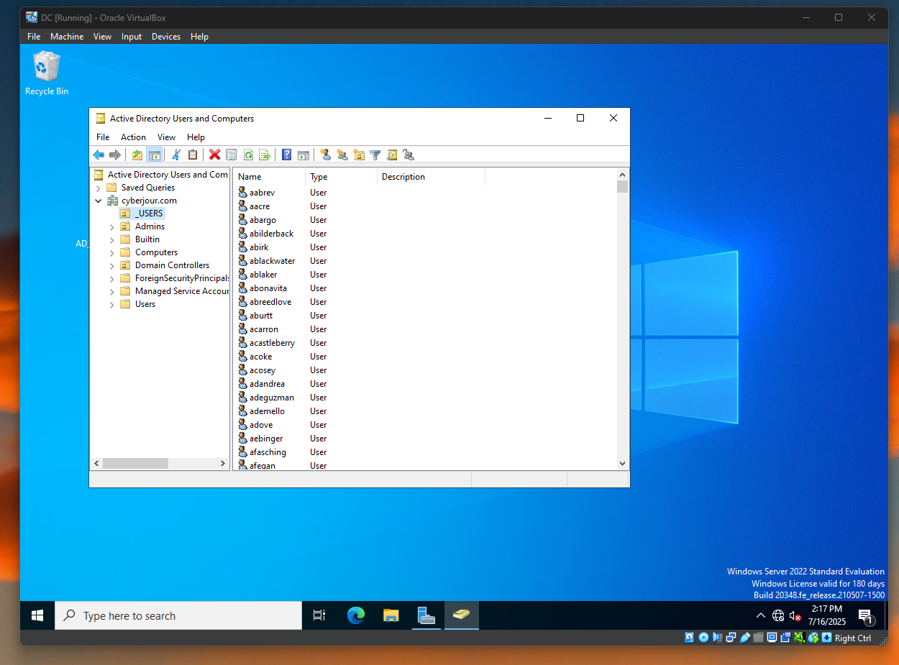
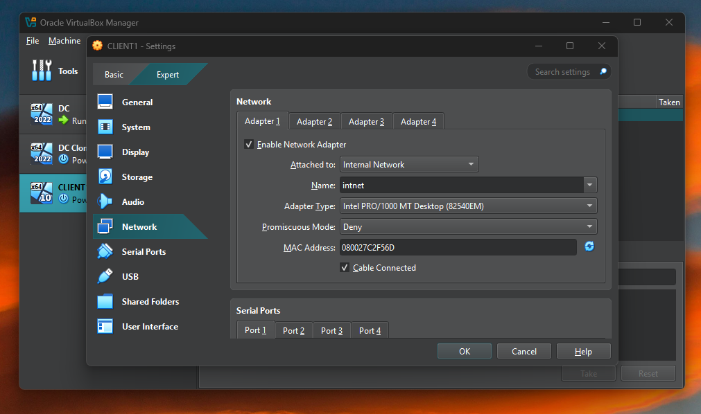
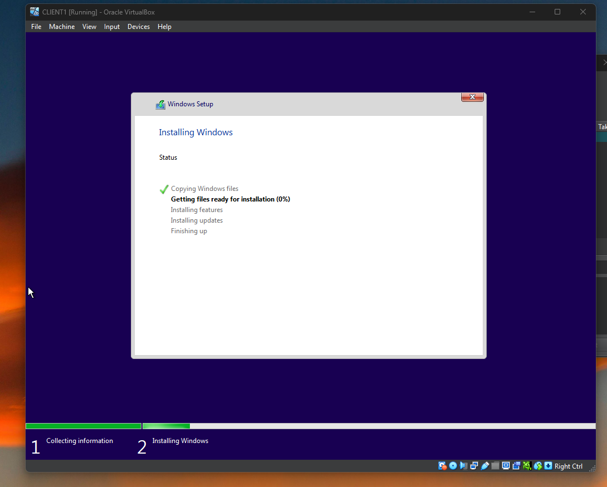
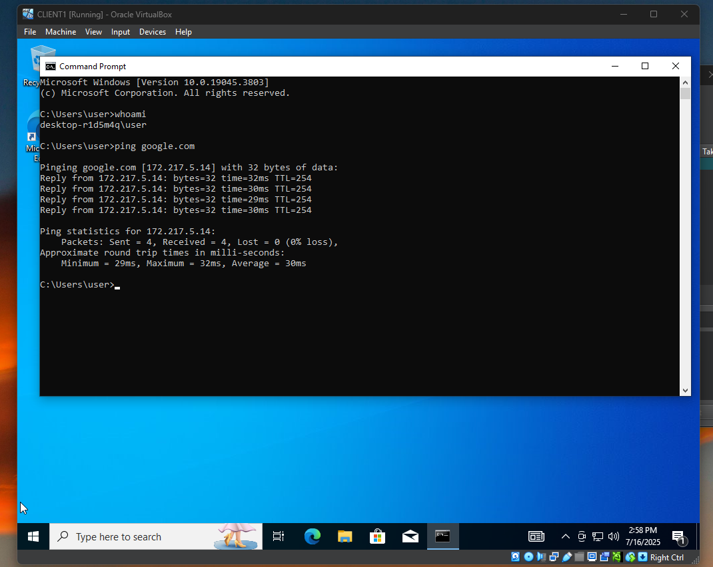
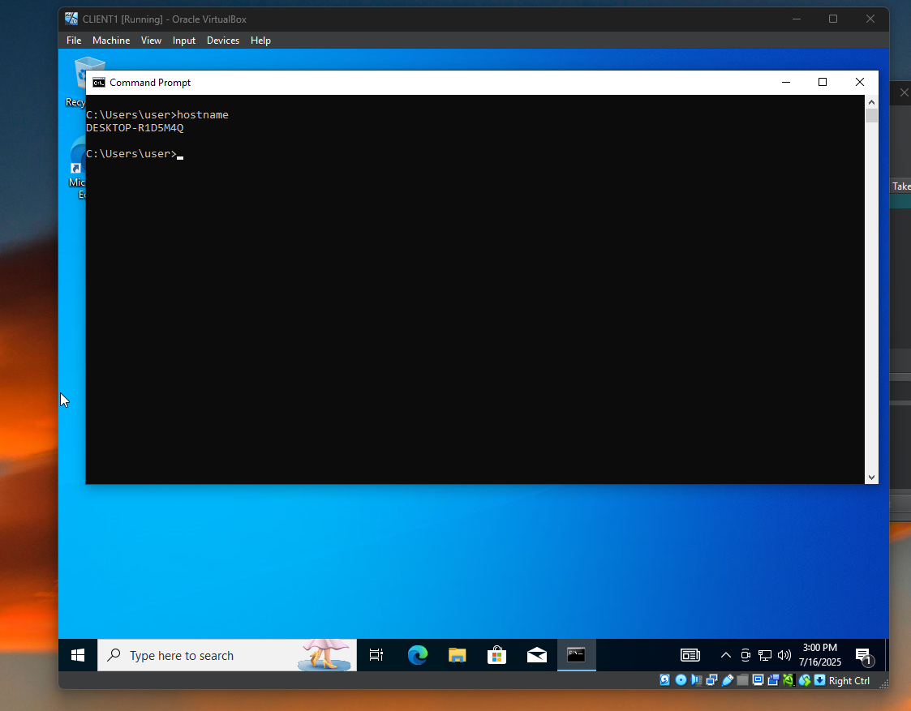
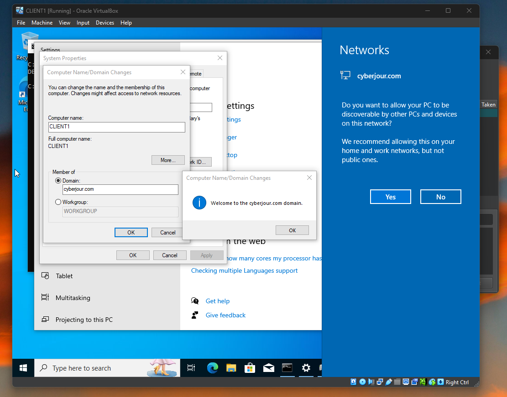
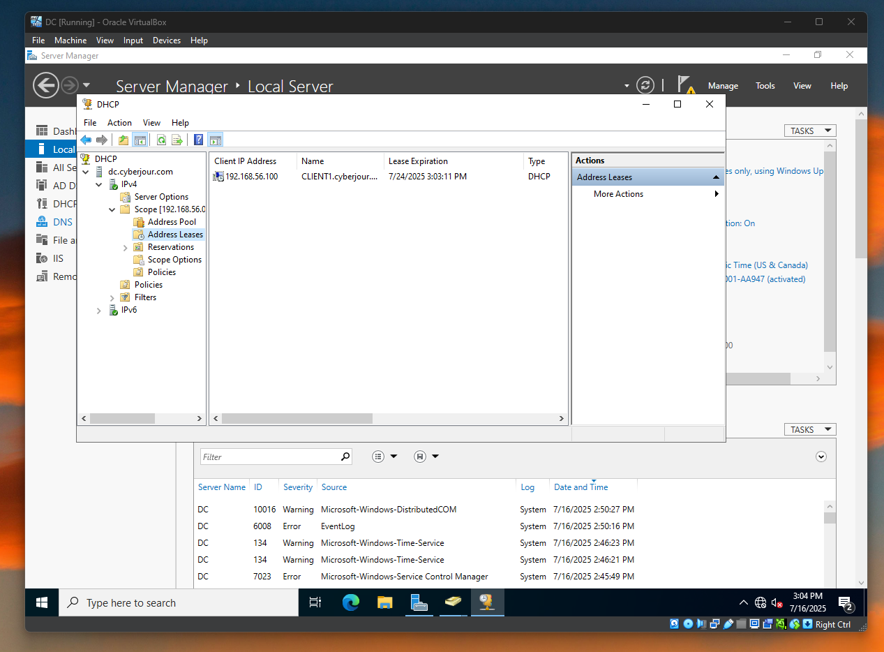
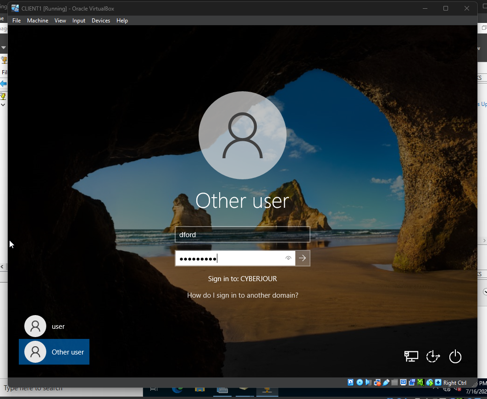
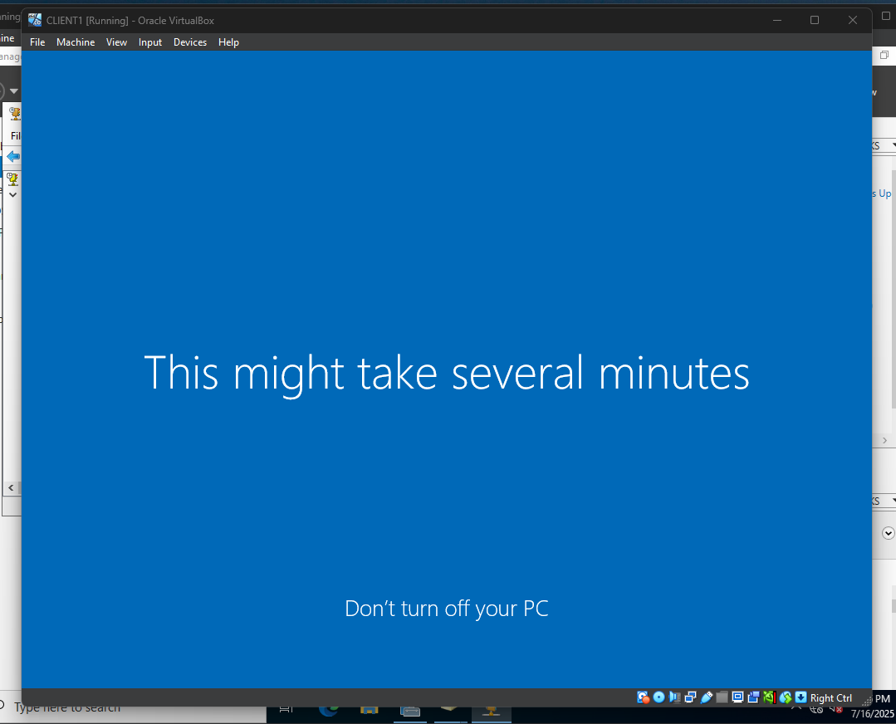

# Active Directory Lab

## Objective

The purpose of this lab is to use VirtualBox to simulate a corporate environment where there are hundreds of users on an internal network.The Domain Controller will have a NAT adapter, enabling internet access, which will also be used by the machines that
are joined to the domain. Windows Server, Active directory and Remote Access will be installed on the Domain Controller.DHCP will be
used to give each machine joined to the domain a unique IP Address. A client machine will also be set up to test logins and domain connectivity. The client machine will have Windows 10 ISO installed. A PowerShell script will be run to create 1000 unique users so they won't have to be created manually, which would take too much time.

## Project Files

| File Name        | Description                        |
|------------------|------------------------------------|
| Images           | Folder for image files             |
| create_users.ps1 | Script to create users             |
| names.txt        | File containing random names       |

## What I Did

Create a new Domain Controller with two adapters, NAT and Internal Network, and Windows Server ISO installed.

 

Install Windows Server ISO on the Domain Controller

  

Install Active Directory

 

Create Domain named `cyberjour`

  

Create Admin User and add to domain admins

 

 

Install and configure Remote Access

 

 

Install, setup, and authorize DHCP Server

 

 

Run PowerShell script in PowerShell ISE to create 1000 users in Active Directory

 

Verify users were successfully created by checking Active Directory

 

Create client machine and install windows

 

 

Upon login, check for internet access by pinging google.com

 

Check host name, join domain, and check DHCP for address lease

 

 

 

Since now domain joined, check if other created users can login

 

 

## Discussion

I installed Windows Server ISO, Active Directory, and DHCP on the Domain Controller. I then created a domain named `cyberjour`, created an Admin User, and added the user to the Admin Domain. Remote Access was also installed for future plans. DHCP was setup to use IP ranges of 192.xxx.100-200. I executed the PowerShell script that references a text file contaning users by first name and last name to mass create 1000 users instead of doing it manually.

The script works as follows:

1. The text file containing users by first and last name is assigned as an array to a variable

2. A for-loop is executed for each name in the array

3. The name is split on the empty string and the value in the first position is assigned to the first name variable the value in the first position (ex. De'Jour Ford --> De'Jour)

4. The name is split on the empty string and the value in the second position is assigned to the last name variable (ex. De'Jour Ford --> Ford) 

5. The username is the result of the first character of the first name + last name then tranformed to lower case (ex. dford)

6. There's a write statement, "Creating User $($usernmae)" to help with debugging if there are issues

7. Finally, a user is created using commands in PowerShell and the variables

8. The process is repeated until each name in the loop is addressed

I then created the client machine and installed the Windows 10 ISO, logged in, and checked for internet connection by pinging google.com. I checked the host name to ensure the client machine wasn't a part of a domain, then added the client to the `cyberjour` domain and checked DHCP for the address lease. With a successful domain join, I tested a differnent user login from Active Directory to confirm everything was working properly.

## Planned Improvements

`Create a seperate Windows Server for DHCP to simulate real-world production environments`
    
    1. DC - Domain Controller
    
    2. SRV-DHCP - DCHP Server
    
    3. CLIENT1 - Client Machine
    
    4. CLIENT2 - Client Machine
    
    5. KaliLinux - Attacker Machine

`Create an internal machine hosting a vulnerable web app`

`Install outdated or vulnerable software and use **Nessus** to do a vulnerability scan`
