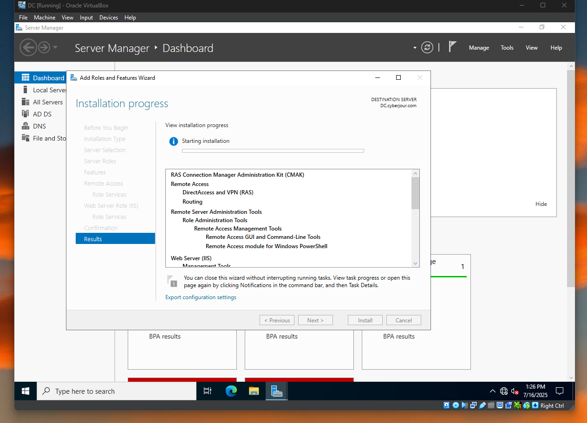

# Active Directory Lab

## Objective

The purpose of this lab is to use VirtualBox to simulate a corporate environment where there are hundreds of users on an internal network.The Domain Controller will have a NAT adapter, enabling internet access, which will also be used by the machines that
are joined to the domain. Windows Server, Active directory and Remote Access will be installed on the Domain Controller.DHCP will be
used to give each machine joined to the domain a unique IP Address. A client machine will also be set up to test logins and domain connectivity. The client machine will have Windows 10 ISO installed. A PowerShell script will be run to create 1000 unique users so they won't have to be created manually, which would take too much time.

## Project Files

| File Name        | Description                        |
|------------------|------------------------------------|
| Images           | Folder for image files             |
| create_users.ps1 | Script to create users             |
| names.txt        | File containing random names       |

## What I Did

Create a new Domain Controller with two adapters, NAT and Internal Network, and Windows Server ISO installed.

 

Install Windows Server ISO on the Domain Controller

  

Install Active Directory

 

Create Domain named `cyberjour`

  

Create Admin User and add to domain admins

 

 

Install and configure Remote Access

 

 

Install, setup, and authorize DHCP Server

 

 

Run PowerShell script in PowerShell ISE to create 1000 users in Active Directory

 

Verify users were successfully created by checking Active Directory

 

Create client machine and install windows

 

 

Upon login, check for internet access by pinging google.com

 

Check host name, join domain, and check DHCP for address lease

 

 

 

Since now domain joined, check if other created users can login

 

 

## Discussion

## Planned Improvements

`Create a seperate Windows Server for DHCP to simulate real-world production environments`
    
    1. `DC - Domain Controller`
    
    2. `SRV-DHCP - DCHP Server`
    
    3. `CLIENT1 - Client Machine`
    
    4. `CLIENT2 - Client Machine`
    
    5. `KaliLinux - Attacker Machine`
